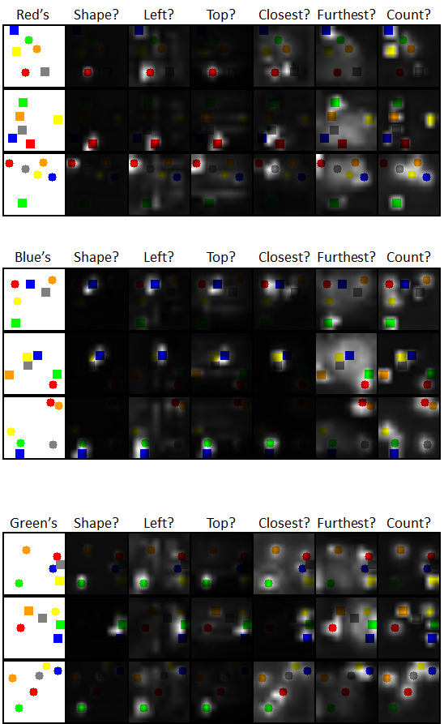

# Pytorch implementation of [FiLM: Visual Reasoning with a General Conditioning Layer](https://arxiv.org/abs/1709.07871)

## Requirements

- Python3
- Pytorch 1.0.0
- TensorBoardX

## Differences from the original implementation

The original implementation used some of the pretrained layers in resnet, or four convolution layers with kernel size = 4 and stride = 2 when starting from scratch.

However, in this implementation, considering that the target is a Sort-of-CLEVR, I reduced the number of layers with stride = 2 to three and added two layers with stride = 1 to increase the size of the feature map.

Initial convolution layer configuration for this implementation is:
```
(Kernel size = 5, stride = 2, padding = 2)
(Kernel size = 3, stride = 2, padding = 1)
(Kernel size = 3, stride = 2, padding = 1)
(Kernel size = 3, stride = 1, padding = 1)
(Kernel size = 3, stride = 1, padding = 1)
```

## Usage

generate sort-of-clevr dataset
```
python soc_generator.py
```

train
```
python train.py 
    --batch_size={64}
    --n_epoch={120}
    --lr={1e-4}
    --weight_decay={1e-4}
    --save_dir={model}
    --dataset={data/sort-of-clevr.pickle}
    --init={kaiming}
    --n_res={6}
    --seed={12345}
    --n_cpu={4}
    [--resume={}]
```

test
```
python test.py
    --n_res
    --dataset
    --model
```

visualize
```
python visualize.py
    --n_res
    --dataset
    --model
    --save_dir [features]
```

Example of a visualized feature map image



## Result

| Sort-of-CLEVR | n_res = 6         |
|---------------|-------------------|
| Accuracy      | 98%               |
